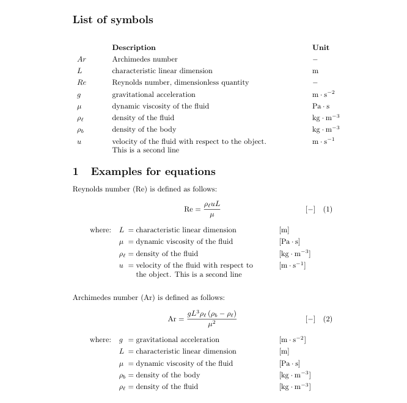

# Symbollist-maintain-Excel
An Excel based solution for maintaining units, symbols and equations for a LaTeX document.

Download .zip file containing all files: http://bit.ly/ExcelSymbolMaintain11

Working example on OverLeaf.com: http://bit.ly/OverleafExampleSymbollist

# Introduction
Thesis documents often contain a lot of mathematical equations. Therefore, in most cases, a symbol list is added to the document and underneath equations, parameter definitions are added.
This projects contains a LaTeX solution for creating a symbol list using the `glossaries` package, together with the `glossaries-extra` package. Next to this, code is provided for showing parameter definitions under a first declaration of the equation in the document.

The goal of this project is defining symbol definitions and units only once and create symbol list and parameter definitions automatically based on this. To help with this, an Excel file (SymbolSheetSecure.xlsx) is created. 

**Bugs or suggestions?**\
Please reach out to me at johanf85git[at]outlook.com

# Instructions
- Download the project and take notice on how the .tex files are built up. For a working example, you can also look at: https://www.overleaf.com/read/svtcgxdkqsxr
- Open the symboldefinitions.xlsm file\
Example data is included
- Define units that are used on the Units tab, see the `siunitx` package manual for syntax\
under '\DeclareSIUnit' add your unitname including '\\'\
under 'definition' add the content of your unit
- Add the symbols to use in your document to the 'Symbols' tab\
Under Symbol: add the symbol (this for your own reference)\
fill the other yellow cells in the row. I started the definition commandname with a D, this is not mandatory. Same for the E of Equation parameter. Do make sure to add a '\\' before the commandname.
- Copy the macros to your LaTeX document preamble. See the "To copy to preamble" tab.
- Add your equations under the 'Equations' tab\
Make sure you wrap every symbol code in extra parenthesis, eg eg {\rho_\ell}. This is necessary for Excel to recognize the symbols properly for generating the right parameter definitions. This does add extra parenthisis, however there is no other option if you want to use Excel for generating the parameter definitions. 
- Double check the the output in your LaTeX document for possible mistakes

**Change order of parameter definitions**\
Currently parameter definitions are generated based on the order on the 'Symbols' tab in Excel. You can order the symbols within Excel with Excel's sort function to alphabetical (based on the latin name, the B column).
\
\
**Compile the glossaries:**\
There are several ways to compile the glossaries. Execute a perl script is one of them. (perl has to be installed)
\
Run the following command in the folder where your tex file with glossaries is saved:\
`perl <path to makeglossaries> <main file>`

Eg, on a mac, running texlive 2017, the command is:\
`perl /usr/local/texlive/2017/texmf-dist/scripts/glossaries/makeglossaries main` \
run this in the directory were your main.tex file is saved
\
\
**Changing the Excel file**\
The Excel tabs are secured, so no unwanted changes can be done by accident. The input cells are available for editing. To make other changes to the Excel, first unsecure the tabs. 
\
\
**To do list for git project:**
- Excel copies content of code with too many spaces and with quotesigns, try to find a solution
- Change tex code to put the Symbols list in alphabetical order in Latin/Greek combined

